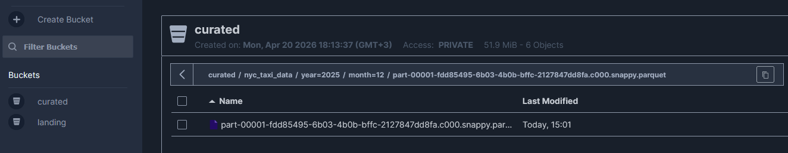
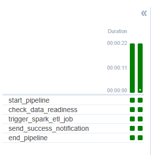
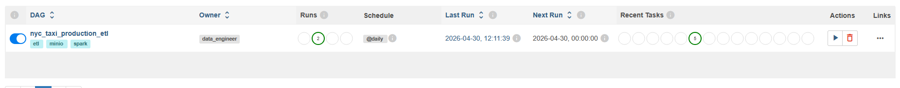

# NYC Taxi End-to-End ETL Pipeline

This repository showcases a comprehensive Data Engineering project that automates the extraction, transformation, and storage of New York City Taxi trip data. 

The project strictly follows the **Medallion Architecture** (Bronze & Silver layers) and utilizes a modern, containerized tech stack to process large volumes of data using distributed computing, fully orchestrated for daily automated runs.

---

## Project Overview

The primary goal of this project was to build a robust, scalable data pipeline that minimizes manual intervention and maximizes data quality and query performance. The pipeline:
1. **Extracts** raw trip data from a simulated S3 Landing Zone.
2. **Transforms** the data using **Apache Spark** to enforce business rules and clean anomalies.
3. **Loads** the curated data into a partitioned Data Lake structure.
4. **Orchestrates** the entire workflow dependencies using **Apache Airflow**.

---

## Tech Stack

* **Processing Engine:** Apache Spark (PySpark)
* **Orchestration:** Apache Airflow
* **Data Lake / Storage:** MinIO (AWS S3 Compatible Object Storage)
* **Containerization:** Docker & Docker Compose
* **Language:** Python
* **Architecture:** Medallion Architecture & Columnar Storage (Parquet)

---

## The Learning Journey

Building upon foundational data pipeline concepts, this project served as a deep dive into distributed data processing and enterprise-grade orchestration. Key milestones achieved during this process:

* **Distributed Processing with Spark:** Transitioned from single-node data manipulation (like Pandas) to utilizing Apache Spark for handling millions of rows efficiently, managing Spark sessions, and terminating them properly to save compute resources.
* **Big Data Optimization (Partitioning):** Implemented smart storage strategies by partitioning the final Parquet files by `year` and `month`. This significantly reduces I/O bottlenecks and enables *Partition Pruning* for downstream analytical queries.
* **Decoupled Architecture:** Successfully separated the "Compute" (Spark) from the "Orchestrator" (Airflow). Airflow acts solely as the traffic controller, triggering independent Spark jobs without carrying the data payload itself.
* **Infrastructure as Code:** Configured a complex multi-container Docker environment where MinIO, Postgres, Spark, and Airflow seamlessly communicate over a custom Docker network.

---

## Data Lake & Medallion Architecture

Data is not just dumped; it is carefully organized. The storage layer simulates AWS S3 using MinIO, divided into distinct zones:

* **Landing Zone (Bronze):** The raw, immutable point of entry for all incoming `.parquet` files.
* **Curated Zone (Silver):** Data that has been cleansed (filtering out negative fares, zero passenger counts) and physically partitioned.

**Visualizing the Partitioned Data Lake:**
*(Notice the `year=.../month=...` folder hierarchy which optimizes future Athena/Trino queries)*

---

## Automated Orchestration (Airflow)

The entire ETL lifecycle is automated using Apache Airflow, running on a daily schedule (`@daily`). The DAG is designed with the "Fail Fast" principle, ensuring Spark jobs are only triggered if the upstream data is ready.

**Pipeline Task Flow:**
1. `start_pipeline`: Marks the initiation of the daily run.
2. `check_data_readiness`: A sensor/bash check verifying the existence of new data in the Landing Zone.
3. `trigger_spark_etl_job`: The core compute task that submits the PySpark job to the cluster.
4. `send_success_notification`: Simulates a team alert (e.g., Slack/Email) upon successful data curation.
5. `end_pipeline`: Successful termination.

**DAG Execution & Task Dependencies:**

**Airflow Main Dashboard:**

---

